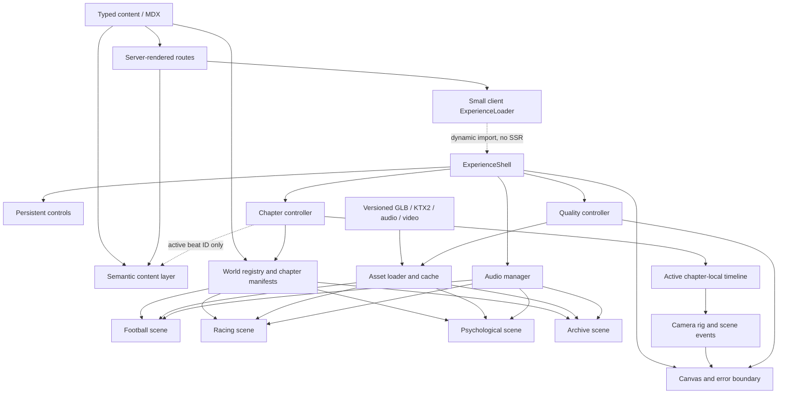
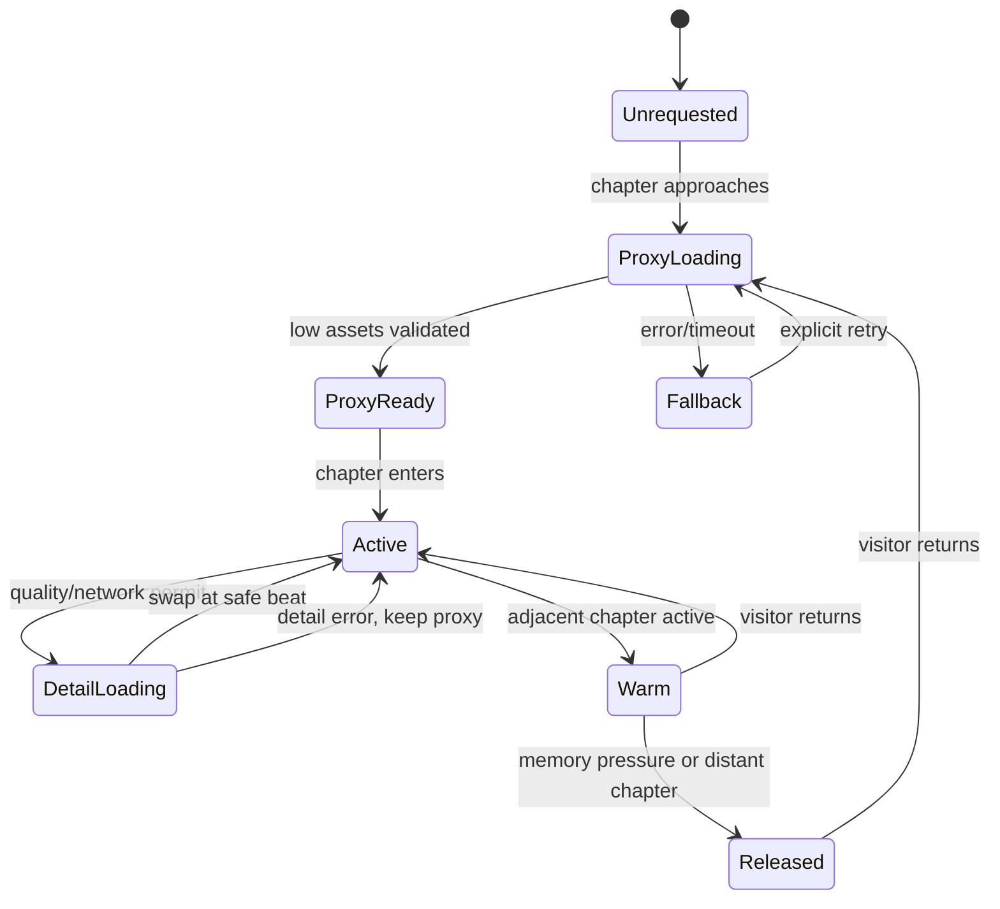

# Aayu Pratap Singh — Personal Website Build Plan

**Prepared:** August 2, 2026

**Source material:** `portfolio.md` and `Aayu_Resume.pdf`
**Project state at planning:** Greenfield source-material review before the application scaffold was created.

**Implementation update:** The coded foundation now includes all four original
procedural worlds, semantic supporting routes, responsive/reduced-motion modes,
and labeled VFX/photography placeholders. The longer production estimates below
refer to replacing procedural studies with final licensed or supplied media and
raising asset fidelity—not to missing website sections.

## 1. Executive decision

Build a **dual-layer portfolio**:

1. A cinematic, progressively enhanced homepage that expresses Aayu's identity through authored 3D worlds.
2. Fast, semantic, crawlable pages that let recruiters and hiring managers verify experience, projects, skills, and results without navigating the cinematic sequence.

The canvas is presentation, not the source of the content. Identity, navigation, project facts, and contact actions must remain available when WebGL is slow, unavailable, skipped, or disabled by reduced-motion settings.

The first coded release contains a complete professional portfolio and authored
procedural interpretations of the football, racing, psychological, and visual
archive worlds. Production-media upgrades should still pass the clarity,
accessibility, rights, and performance gates defined in this document.

### Why this scope is right

The visual brief describes an AAA-quality production across four near-photoreal worlds. That is an asset-production project as much as a web-development project. Attempting all four at once would create the exact failure the brief warns against: weak geometry, generic rooms, long load times, and content hidden behind spectacle.

The website succeeds only when a visitor can answer these questions quickly:

- Who is Aayu?
- What does he build?
- What has he personally owned or improved?
- What evidence supports the claims?
- How can I view the work, download the résumé, or contact him?

## 2. Positioning and audience

### Primary audience

- Recruiters and hiring managers for software engineering, ML, product engineering, systems, and creative-technology roles
- Engineering leaders evaluating ownership, technical judgment, and measurable impact
- Technical or creative collaborators discovering Aayu through projects or visual work

### Working positioning

> Aayu Pratap Singh is a computer science student, founder, and engineer building secure full-stack products, machine-learning systems, reliable infrastructure, and real-time performance simulations.

“Creative technologist” and “with a cinematic eye” can become supporting language only after creative work is supplied and demonstrates that positioning.

### Recommended hero copy

**Aayu Pratap Singh**

**Engineering performance. Directing experience.**

University of Waterloo computer science student, founder, and engineer working across full-stack products, machine learning, infrastructure, and simulation.

Primary actions:

- Explore selected work
- View quick portfolio

Résumé and contact remain visible in the persistent navigation rather than becoming two more hero buttons.

Use Aayu's real name throughout. The visual archive should present VFX and
photography as disciplines, with honest placeholders until credited media is
provided; it should not introduce a separate creative alias.

### Target visitor journeys

| Visitor | Intended path | Time target |
| --- | --- | --- |
| Recruiter | Identity → skip/quick view → experience → featured work → résumé/contact | 30–90 seconds |
| Hiring manager | Deep-linked case study → role → architecture/tradeoffs → result → evidence | 3–5 minutes |
| Engineering collaborator | Cinematic overview → ML/full-stack/system work → GitHub/contact | 2–5 minutes |
| Creative visitor | Cinematic journey → creative archive/reel → writing/contact | Open-ended |
| Mobile/reduced-motion visitor | Editorial version containing the same facts and actions | No forced WebGL |

No deep link should force a visitor through the prologue.

## 3. Content source of truth

For version one, the résumé governs education, work, project, technology, date, and impact claims. The brief governs self-described interests and creative direction. Label ongoing work clearly as **In progress**; creative-work claims still require actual artifacts and evidence.

### Publishable content inventory

#### Education

- University of Waterloo
- Bachelor of Computer Science, Honours, Co-op
- September 2024–April 2029; phrase publicly as **expected April 2029**

#### Experience

1. **UniMarket — Founder & Sole Engineer** (June 2026–present)
   - Independently built marketplace restricted to users verified through an `@uwaterloo.ca` email address, using Next.js, TypeScript, Supabase, PostgreSQL, and Vercel
   - Email OTP, row-level access controls, protected routes, private storage, listings, drafts, uploads, search, messaging, moderation, and responsive UI
   - `https://www.myunimarket.com` is embedded as a PDF link annotation; verify that it is live, owned, and ready for public traffic before publishing it

2. **WAT.AI – SportsNext — Machine Learning Engineer** (June 2026–present)
   - Mamba-based sequence modeling and a Dreamer-style recurrent state-space model for soccer dynamics
   - PyTorch pipelines and next-action prediction over tracking, ball-state, context, and event data

3. **ATS Corporation — Network Technician Co-op** (September 2025–April 2026)
   - Designed/deployed 30+ private project networks
   - Improved wireless performance by up to 3×
   - Refreshed 3 racks and 18 Cisco Catalyst 9200 switches
   - Resolved 150+ incidents with a reported 97% permanent closure rate
   - Supported 10+ sites and served as sole onsite network engineer at the Cambridge headquarters

#### Projects

1. **F1 Strategy Engine** (May 2026–present)
   - Telemetry ingestion, tyre degradation, lap-time simulation, race-state evaluation, and probabilistic strategy analysis

2. **AI Personal Finance Manager** (April 2026–present)
   - Categorization, analytics, dashboards, RAG-based querying, and personalized budgeting/investment recommendations

3. **Emotion-Powered Music Mixer** (December 2024–June 2025)
   - Facial, lip, and body-motion analysis; emotion-aware playback and music transitions; Spotify, Librosa, MediaPipe, DeepFace, Flask

#### Skills to expose selectively

- **Core:** Python, TypeScript, JavaScript, C, C++, SQL
- **Product/web:** Next.js, React, Node.js, Express, Flask, Supabase, PostgreSQL, MongoDB
- **ML/data:** PyTorch, TensorFlow, Pandas, NumPy, SciPy
- **Infrastructure:** Cisco CLI, Catalyst 9200, Catalyst 9800 WLC, Meraki, Infoblox
- **Delivery/testing:** Git, Docker, Vercel, REST APIs, Playwright, Vitest

Do not present skills as a logo cloud. Attach technologies to specific evidence and decisions in each case study.

### Content held back until verified

The brief mentions CC3K, UWSpaces/GTM, Rhombus, VFX, editing, photography, and blogs, but those items are absent from the résumé and no supporting media is in the folder. Do not publish them until copy, dates, ownership, outcomes, links, and media are supplied.

### Public-content safeguards

- Do not publish the phone number by default. Use email, GitHub, and a contact route. The supplied PDF contains the phone number, so create a separate public résumé variant with it removed unless Aayu explicitly approves publishing it.
- Describe UniMarket as independently built for users verified through an `@uwaterloo.ca` email address, not university-endorsed, unless formal endorsement exists.
- Confirm ATS confidentiality before publishing site names, topology visuals, security details, hardware counts, or internal screenshots. Keep the case study outcome-focused.
- Verify how the 3× performance and 97% permanent-closure figures were measured.
- Credit the WAT.AI team and confirm permission before publishing model diagrams, data details, or unpublished results.
- Use synthetic financial data and label the AI finance project as educational/prototypical, not financial advice.
- Explain consent and data handling for any emotion-recognition demo; never publish identifiable face data without permission.
- Create a public résumé variant, rename it to `Aayu-Pratap-Singh-Resume.pdf`, add PDF metadata/tags, remove the phone unless approved, and mirror its contents as semantic HTML.

## 4. Information architecture

### Primary routes

| Route | Purpose |
| --- | --- |
| `/` | Cinematic, chapter-based overview with immediate identity and escape controls |
| `/experience` | Semantic professional timeline |
| `/projects` | Crawlable selected-project index |
| `/projects/unimarket` | Product/full-stack founder case study |
| `/projects/sports-world-model` | ML case study, within team/publication limits |
| `/projects/f1-strategy-engine` | Telemetry/simulation hero case study |
| `/projects/ai-finance-manager` | RAG/data-product case study |
| `/projects/emotion-music-mixer` | Real-time multimodal creative-tech case study |
| `/about` | Short biography, values, interests, and sought opportunities |
| `/archive` | VFX/editing/photography only after real media is supplied |
| `/writing` and `/writing/[slug]` | Later phase; readable articles, not text embedded only in 3D |
| `/resume` | Accessible HTML résumé and PDF download |
| `/contact` | Email, GitHub, availability, and optional contact form |

### Persistent controls on the immersive homepage

- Name/short role
- Current chapter and progress
- Chapter navigation
- Skip experience / view text version
- Sound off/on
- Reduced-motion toggle
- Résumé
- Contact

These controls should be visually restrained but never hidden behind hover-only interaction.

### Case-study structure

Every case study should answer, in this order:

1. What problem or opportunity existed?
2. Who was it for?
3. What was Aayu's exact role and ownership?
4. What constraints shaped the work?
5. What architecture or approach was chosen, and why?
6. What was the hardest tradeoff or failure?
7. What result exists today?
8. What evidence can a visitor inspect: demo, repository, screenshots, diagram, or metric?
9. What would be improved next?

## 5. Cinematic world plan

### Prologue — Identity before spectacle

**Purpose:** Establish name, role, and value within the first screen. The page is usable immediately; “Enter with sound” is explicit and “View quick portfolio” is always visible.

| Beat | Purpose/content surface | Key assets | Camera/event | Light/audio | Entry/exit |
| --- | --- | --- | --- | --- | --- |
| Cold open | Semantic HTML shows name, engineering positioning, and one primary “Explore” action | Black field, film grain, one low-resolution blue-white light plate | Camera remains nearly locked; no preloader gate | Silence/very low room tone; sound off | Direct page load; quick view and persistent résumé/contact already work |
| Identity fragments | Environmental previews communicate football, precision engineering, psychological atmosphere, and image-making before résumé facts appear | Floodlight edge, telemetry reflection, concrete seam, projection dust | Slow 35–50 mm push; fragments appear through occlusion rather than a montage of cards | Four restrained motifs crossfade without audible playback until opted in | Visual fragments converge into a stadium service-door silhouette |
| Threshold | Sets expectations and lets the visitor choose the cinematic route or quick route | Service door, practical lamp, chapter marker | Scroll opens the threshold; Enter with sound only unlocks audio | Lamp blooms; distant crowd texture begins only after consent | Door darkness becomes the Football entry frame |

The prologue fallback is the same semantic hero over a single cinematic still. It never waits for Three.js.

### World 1 — Football / professional experience

**Narrative:** Elite performance depends on preparation, systems, teamwork, and infrastructure that works under pressure. Football is a personal metaphor, not a claim that every role was in sports.

**Content mapping:**

- Locker preparation station → UniMarket founder/sole-engineer ownership
- Stadium service infrastructure → ATS networking and operational impact
- Tactical analysis room → SportsNext world-model research
- Pitch reveal → combined value proposition and invitation to view full experience

**Visual language:** Deep blue, steel, cool-white practical lights, restrained pitch green, polished/wet floor response, fabric, rails, cabling, signage, and a distant stadium bowl. Avoid official Chelsea crests or a literal Stamford Bridge replica unless assets and marks are licensed.

Preserve Chelsea specificity through an original west-London night-match language: deep royal blue, tight urban arrival scale, brick/steel service architecture, matchday ritual, cold floodlight, and an emotionally large pitch reveal. The environment must not imply a generic arena, but it must remain legally distinct.

The architecture needs recognizable silhouettes and layered compositions: a compressed exterior threshold, angled service geometry, partially occluding equipment in the foreground, occupied preparation surfaces in the midground, and stadium scale/floodlights in the background. Job text is secondary to ritual, tension, and the sense that reliable performance is built backstage. The detailed shot plan and release gate appear in section 11.

### World 2 — Racing / selected technical projects

**Hero:** F1 Strategy Engine.

**Supporting work:** AI Personal Finance Manager and Emotion-Powered Music Mixer on adjacent engineering surfaces; link UniMarket only where useful rather than duplicating its whole story.

**Visual language:** Graphite, carbon, metal, rubber, controlled red/amber accents, diagnostic displays, cables, tool systems, tyres, and mechanical detail. Use a licensed/generic open-wheel vehicle and original livery; do not imitate a current F1 team identity.

| Beat | Purpose/content surface | Key assets | Camera/event | Light/audio | Entry/exit |
| --- | --- | --- | --- | --- | --- |
| Inspection threshold | Establish precision and reveal the F1 Strategy Engine title | Garage shutter, inspection strip, floor rails, partial vehicle silhouette | Football floodlight match-cuts to an inspection light; low dolly enters beneath equipment | Crowd tail becomes compressed-air release and electrical hum | Entry from Football; shutter darkness protects the world load |
| Hero vehicle reveal | Environment communicates performance engineering before project copy | Licensed/generic open-wheel hero car, lift/support hardware, tyres, work lamps | Controlled three-quarter arc; light sweep reveals actual body/aero detail | Carbon/metal highlights; restrained servo and cooling sounds | Settles on a shareable campaign-style still |
| Telemetry ingestion bay | Explain data sources and pipeline at a glance on real pit monitors | Telemetry wall, timing stand, cables, engineering desk, original diagrams | Camera racks from wheel/suspension foreground to monitors; one data trace comes alive | Cool screen emission, no fake sci-fi HUD; subtle beeps | Direct link opens the semantic F1 case study |
| Strategy table | Show compound, pit timing, fuel, weather, and probabilistic tradeoffs | Physical strategy desk, tyre samples, notes, weather display, timing screens | Overhead-to-oblique move; scroll compares two scenarios without requiring interaction | Controlled red/amber accents and low engine texture | A clear “View system design” link exists in the DOM layer |
| Real-time response bench | Secondary projects show a shared theme: turning signals into decisions | Separate diagnostic bench, audio hardware, neutral data display | Short lateral pass; AI Finance and Emotion Mixer receive one concise evidence line each | Audio spectrum/motion cue kept restrained and optional | Secondary work never competes with the F1 hero |
| Pit exit | Conclude with engineering identity and lead into observation | Pit equipment, light gantry, abstract track edge, closing project links | Forward push stops before implied launch; no gimmicky race animation | Engine texture decays into fluorescent/industrial resonance | Telemetry lines lose sync and become observation-monitor scan lines |

The semantic fallback uses the F1 Strategy Engine as the hero case study followed by two conventional project summaries. The racing world cannot enter production until the hero model's web/commercial rights, silhouette, close-up materials, desktop/mobile variants, and first-load budget pass review.

### World 3 — Psychological architecture / about

**Purpose:** Communicate curiosity, taste, working philosophy, and personality without making Aayu seem distant or unsafe to work with.

**Content:** Short biography, values, how Aayu approaches difficult systems, and the types of opportunities sought. The brief self-identifies football, F1, film, horror, psychology, and VFX as interests; confirm the final list and wording before publishing it as biography.

**Guardrail:** Tension comes from composition, silence, scale, and implication—not jump scares, flashing, monsters, or copied game/film art direction.

| Beat | Purpose/content surface | Key assets | Camera/event | Light/audio | Entry/exit |
| --- | --- | --- | --- | --- | --- |
| Intake threshold | Shift from external performance to the person behind it | Observation window, concrete portal, analog monitor, intake light | Racing scan lines stabilize on a real monitor; camera passes through an offset threshold | Garage hum narrows into fluorescent buzz and low room pressure | Entry hides the asset handoff behind darkness/glass reflection |
| Observation hall | Introduce a short biography through place, not a résumé plaque | Articulated brutalist hall, glass partitions, vents, service rails, sparse records | Slow axial move with strong foreground occlusion; a human-scale chair anchors scale | Sickly white practicals with one warm cue; near-silence | One concise biographical line appears on an observation transcript |
| Values archive | Reveal 3–4 verified working values and how they show up in projects | File drawers, projector, paper/film records, original diagrams | Camera tracks parallel to drawers; only selected records respond to chapter progress | Projector/mechanical texture; no horror sting | Semantic `/about` owns the complete readable copy |
| Spatial anomaly | Express curiosity and willingness to investigate hard systems | Bespoke looping stair/door geometry, mirrored glass, repeating fixture | A subtle impossible alignment occurs on scroll, then resolves; no forced disorientation | Low sub pressure and a restrained light phase change | Reduced-motion mode uses two static compositions and a dissolve |
| Reflection chamber | Humanize the experience with interests and opportunity statement | Shallow reflective surface, bench, single portrait/object only if supplied, soft exit light | Camera slows and lowers to human eye level; motion nearly stops | One warmer motivated light enters; ambience releases tension | A direct About/Contact link remains visible and focusable |
| Projection threshold | Bridge inner world to creative output | Projection aperture, dust, optical housing | Camera turns toward a beam; concrete disappears in overexposure | Projector flutter replaces fluorescent buzz | Beam becomes the Creative Archive entrance |

The semantic fallback is a warm, concise `/about` page with interests clearly attributed as self-described. This world requires an original architectural concept, a motion-sensitivity review, a no-flash check, and still-frame approval before production.

### World 4 — Creative archive

**Status:** Deferred until real VFX, editing, photography, reel, and writing assets exist.

**Content rule:** Every item needs title, year, context/client, exact role, tools, permission to publish, and a playable/viewable source. A smaller archive of excellent work is preferable to decorative placeholders.

| Beat | Purpose/content surface | Key assets | Camera/event | Light/audio | Entry/exit |
| --- | --- | --- | --- | --- | --- |
| Calibration vestibule | Establish that this is a working image lab, not a gallery | Projector, calibration chart, optical bench, shutters, cable runs | Projection beam carries camera into a compact calibration space | Projector mechanism and soft room tone | Entry from Psychological beam; remains a still if no media is ready |
| Hero reel chamber | Present one short, rights-cleared reel or hero creative piece | Large projection scrim, original reel, projector housing, seating/console | Slow lateral reveal lets the image light the architecture | Reel audio is captioned, user-controlled, and never auto-unmutes | Direct link opens the media item outside the 3D flow |
| Frame/contact corridor | Show a tightly curated set of VFX/editing/photography work | Suspended scrims, contact sheets, light table, lens hardware | Camera moves past foreground frames with controlled parallax; selected frames pause | Soft servo movement and image-driven color spill | Mobile fallback becomes a responsive editorial strip |
| Process bench | Show role, tools, breakdowns, and before/after only where permitted | Edit/grading controls, scan monitor, before/after source media | One before/after wipe tied to local progress; not a generic carousel | Neutral calibrated light, minimal interface sound | Semantic item page contains full credits and accessibility text |
| Writing archive | Introduce up to three real articles/reflections | Pull-out drawers, illuminated paper/film ribbons, typographic projections | Drawers open through chapter progress; no long paragraph in 3D | Quiet mechanical movement; no voiceover required | Every title links to `/writing/[slug]` |
| Communications aperture | Resolve image-making into the Finale | Shutter, communications light, final projector frame | Projection closes to a narrow title-card aperture | Projector slows; final room tone emerges | Exit only activates once real archive content exists |

The archive release gate requires at least one hero reel/piece and three supporting items with rights, credits, alt text/captions, semantic pages, optimized media, and mobile stills. Until then, omit the chapter from primary navigation rather than shipping placeholders.

### Finale — Contact / exit

A quiet communications chamber or title-card composition containing one confident closing line, email, GitHub, résumé, confirmed availability, and replay/chapter controls.

| Beat | Purpose/content surface | Key assets | Camera/event | Light/audio | Entry/exit |
| --- | --- | --- | --- | --- | --- |
| Resolution | Let the previous world's texture settle before asking for action | Communications console or title wall, practical light, subtle environmental carryover | Camera comes fully to rest | Sound simplifies to one clean room tone | Accepts entry from Archive or directly from the last available chapter |
| Contact title | Present one primary contact action plus persistent GitHub/résumé | Diegetic communications surface and semantic DOM links | No camera travel while the user reads or focuses controls | Stable high-contrast light; no pulsing | Keyboard focus moves predictably into contact controls |
| Exit/replay | Offer replay, chapter return, and quick portfolio | Closing shutter/title card | Optional slow pullback only when motion is allowed | Audio fades cleanly and stops | No dead end; direct `/contact` remains available |

No generic form is required for version one. If a form is later added, it needs spam protection, a clear success/error state, and a direct email fallback.

## 6. Interaction and scroll choreography

Use native vertical scroll as the input. A global chapter controller maps document position and navigation requests to normalized chapter progress; each independently loadable world owns its own GSAP timeline. This avoids a monolithic timeline that would make deep links, asset retries, reduced modes, and future chapter additions brittle. Do not scroll-jack, trap the wheel, or require free-roam controls.

### Global behavior

1. Server-rendered identity and controls paint first.
2. A lightweight poster/low-resolution environment appears immediately.
3. The current world loads progressively.
4. Scrolling updates the active chapter's normalized progress; its local timeline moves a camera rig along exported markers and triggers a small number of environment events.
5. Chapter navigation requests a chapter/beat ID; the controller resolves it to the correct document anchor and local timeline label.
6. The next world preloads only after the current one becomes stable and network/device conditions permit it.
7. Deep links open their semantic page directly.

### Cross-world transition matrix

| From → to | Visual match | Camera/load cover | Audio bridge | Reduced/mobile fallback |
| --- | --- | --- | --- | --- |
| Prologue → Football | Blue-white fragment becomes a stadium service lamp | Door silhouette and near-black threshold cover first-world activation | Silence/room tone → distant matchday reverb after consent | Dissolve from hero still to football chapter still |
| Football → Racing | Stadium floodlight becomes a garage inspection strip; wet floor becomes polished pit floor | Camera passes behind tunnel equipment/shutter while Racing activates | Crowd/reverb tail → compressed air and electrical garage hum | Matched light wipe between chapter stills |
| Racing → Psychological | Telemetry trace loses sync and becomes an analog observation-monitor scan line | Vehicle/monitor occlusion leads into glass/concrete darkness | Engine/electrical tone narrows into fluorescent buzz and low architectural pressure | CRT-style dissolve with no flashing |
| Psychological → Archive | Observation projector beam expands until architecture disappears | Overexposed beam covers Archive activation | Fluorescent buzz → projector flutter and optical servo | White dissolve into calibrated projection still |
| Archive → Finale | Final projected frame closes into a communications aperture/title card | Shutter/title card contains minimal Finale assets | Projector slows → clean closing room tone | Simple editorial section transition |

Transitions are prototypes, not excuses to keep two heavy worlds resident. Each must work with the destination's low-resolution proxy before it is approved for production.

### Motion grammar

- Slow dolly, push, crane, and restrained orbit movements
- 35–50 mm-equivalent compositions for most shots; avoid extreme FOV distortion
- Foreground occlusion used for transitions
- Audio leads visuals slightly during chapter transitions
- Focus and lighting changes reveal content; nothing important requires pixel hunting
- Fast scrolling settles cleanly at a valid composition
- Reduced-motion mode replaces travel with short dissolves or static editorial frames

### Information presentation

Information may appear visually on tactical boards, monitors, signage, or archive surfaces, but the exact content must also exist in a semantic DOM layer. The Canvas is `aria-hidden`; the DOM version owns reading order, links, focus, and screen-reader output.

Use three coordinated presentation states:

1. **Cinematic view:** project text onto or spatially anchor it to real environment surfaces. Permit only a chapter label and one contextual “View case study” action outside the world. Do not place bordered cards, glass panels, or dashboard rectangles over the Canvas.
2. **Assistive companion:** expose synchronized semantic headings, summaries, and links in a logical DOM order. Focus never depends on a 3D hit target.
3. **Quick/text view:** expand the same content into a conventional readable layout with no Canvas dependency.

The environment must communicate the chapter's identity before a résumé fact activates. Every scene storyboard should include a text-free frame that still explains the intended emotion and theme.

## 7. Technical architecture

### Recommended stack

- Next.js App Router and TypeScript
- React Three Fiber, Three.js, and Drei for the progressive 3D layer
- GSAP ScrollTrigger for chapter-local authored timelines coordinated by a global chapter controller
- CSS/WAAPI for ordinary interface transitions; add Framer Motion only if a specific UI need justifies it
- Zustand for low-frequency shared state such as chapter, quality tier, sound, and loading status
- Typed local content or MDX as the canonical content source; no CMS in version one
- Vitest for unit tests, Playwright for journeys, axe for automated accessibility checks, and Lighthouse CI for regression gates
- Vercel for the application; immutable CDN/object storage for large versioned 3D, audio, and video assets if repository hosting becomes impractical

The App Router page and layouts remain server components that render identity, navigation, and semantic content. A very small client `ExperienceLoader` dynamically imports a client-only `ExperienceShell` with SSR disabled; only that subtree may import R3F, Three.js, Drei, GSAP, Web Audio, or browser capability APIs. The semantic layer and `ExperienceShell` are siblings: the shell receives content IDs/manifests and emits active beat IDs, but it does not own or import the résumé/project copy. This boundary prevents the cinematic bundle from leaking into semantic routes or the initial server render.

### System diagram



### World lifecycle and contracts



Every world module implements a small contract: `manifest`, `preload(tier)`, `activate(progress)`, `setProgress(0..1)`, `deactivate()`, `release()`, `getFallbackArt()`, and named semantic beat IDs. Timeline code consumes IDs rather than importing content copy directly.

### Suggested project structure

```text
app/
  page.tsx
  experience/page.tsx
  projects/page.tsx
  projects/[slug]/page.tsx
  about/page.tsx
  archive/page.tsx
  writing/page.tsx
  writing/[slug]/page.tsx
  resume/page.tsx
  contact/page.tsx
components/
  experience/
    ExperienceLoader.tsx
    ExperienceShell.tsx
    SemanticCompanion.tsx
    CanvasBoundary.tsx
  navigation/
  content/
  media/
scenes/
  core/
    chapter-controller.ts
    quality-controller.ts
    asset-loader.ts
    audio-manager.ts
    world-contract.ts
    world-registry.ts
  football/
  racing/
  psychological/
  archive/
content/
  profile.ts
  experience.ts
  projects.ts
  creative.ts
  writing/
lib/
  accessibility/
  audio/
  performance/
  seo/
  analytics/
public/
  models/
  textures/
  audio/
  images/
  video/
tests/
```

### State boundaries

- Keep résumé/project content in typed server-readable data, not Zustand.
- Keep 60 fps camera/object animation in refs and the render loop, not React state.
- Use global state only for discrete user settings and chapter changes.
- Persist sound, reduced-motion, and quality preferences locally.
- Treat each world as an independently loadable bundle with an explicit load/unload contract.

## 8. Asset-production plan

### Pipeline

1. Create a storyboard and camera animatic before detailed modeling.
2. Build each world as modular set pieces in Blender, with real-world scale and named camera/event markers.
3. Use production-quality licensed assets for hero objects; remodel or hide weak close-up geometry.
4. Bake lighting/AO where possible and reserve dynamic lights for narratively important changes.
5. Export modular GLB files per zone, not one monolithic site file.
6. Compress geometry with Meshopt or Draco, transcode textures to KTX2, and create explicit LODs.
7. Instance repeated seats, lights, bolts, cables, tyres, and structural elements.
8. Store a license/source record for every model, texture, sound, font, logo, photograph, and video.
9. Generate a cinematic still for every chapter; each still doubles as Open Graph art and the low/no-WebGL fallback.

### Priority by world

| World | Hero assets | Supporting assets | Hold point |
| --- | --- | --- | --- |
| Football | Player/service tunnel, locker/tactical area, pitch/stadium reveal | Benches, fabric, boots, rails, fixtures, cabling, camera gear, signs | Must pass as a real place in still frames before coding all interactions |
| Racing | Licensed open-wheel or performance vehicle, garage bay, telemetry wall | Tyres, tools, suspension/brake parts, desks, cables, pit equipment | Hero car silhouette and materials must pass first |
| Psychological | Distinct brutalist observation/archive structure | Glass, file systems, vents, lights, puddles, monitors, dust/fog | Architecture must be more than a dark corridor |
| Archive | Projectors, optical bench, projection surfaces, edit/grading station | Lenses, reels, controls, scrims, frame strips | Do not build until real portfolio media is ready |

### Actionable acquisition and variant plan

Every asset enters a world manifest with: asset ID, source/creator, bespoke or licensed status, license URL/file, commercial-web permission, attribution requirement, modification permission, world/beat, hero/detail/background priority, LOD variants, texture set, compressed transfer size, estimated decoded GPU cost, fallback art, approval owner, and status (`candidate`, `approved`, `optimized`, `shipped`). Unknown rights means the asset cannot enter production.

| World | Bespoke work | Licensed/sourceable work | Materials and audio | Variants and provisional budget | Approval gate |
| --- | --- | --- | --- | --- | --- |
| Football | Original west-London stadium/service architecture, silhouette, signs, tactical-screen design, camera markers, lighting composition | Football equipment, benches/lockers, fabric/kit, boots, rails, fixtures, cameras, cables/pipes; all modified into one coherent set | Painted steel, wet concrete, rubber, fabric, glass, restrained grass; original/licensed room tone, crowd bed, footsteps, cloth, electrical hum | Proxy; high/medium GLBs; mobile still/pre-render. Treat **8–12 MB as the initial visible-zone transfer**, then lazy-load later zones in measured chunks; set the total-world/GPU cap after the proxy and texture test | Six concept stills, real-scale proxy walkthrough, rights ledger, first-load measurement, high/medium/mobile proof, and no-blocky-room review |
| Racing | Original garage architecture, livery, telemetry UI/diagrams, strategy desk content, camera/event markers | Hero open-wheel/performance vehicle with explicit commercial-web rights; tyres, tools, suspension/brake parts, workstations, pit equipment | Carbon weave, clearcoat paint, metal, rubber, glass, polished floor; original/licensed air tools, compressed air, cooling, servo, electrical and restrained engine layers | Hero proxy plus high/medium car; lower LOD/background; mobile campaign still/sequence. Provisional initial hero zone 10–16 MB, later bays 4–8 MB each, validated against device memory | License and silhouette/material turntable, hero still, close-up test, telemetry legibility, fallback, and sustained-frame test |
| Psychological | Bespoke observation/archive architecture and spatial anomaly; original record/surveillance graphics | Industrial fixtures, vents, pipes, glass hardware, file systems, analog monitors, chairs, minor clutter | Concrete/rebar, painted metal, glass, water, paper, acoustic dust/fog; original/licensed fluorescent, mechanical, room-pressure and projector layers | High/medium architecture, simplified anomaly, static reduced-motion compositions. Provisional initial zone 6–10 MB, later zones 3–6 MB each | Originality review, no-dark-corridor still set, vestibular/no-flash review, semantic About content approval, fallback and performance test |
| Archive | Original spatial layout, calibration graphics, media frames, edit/process breakdowns, camera/event markers | Projectors, optical hardware, lenses, reels, grading/edit controls, scrims, light tables | Blackened metal, lens glass, fabric screens, paper/film, calibrated image emission; projector, servo, reel and room-tone layers | Architecture initial zone 5–8 MB; media delivered responsively/streamed and excluded from GLB; optimized still for every playable item; static mobile editorial strip | Minimum content inventory met, rights/credits/captions complete, playback test, responsive-media budget, fallback and still-frame approval |

File budgets are transfer hypotheses for the technical spike, not permission to crush texture quality blindly. If an approved hero cannot meet a budget without visible damage, redesign the shot/loading boundary or move that device tier to a pre-rendered fallback.

### Rights and brand rules

- Do not use Chelsea crests, official stadium scans, F1 logos, team liveries, recognizable commercial car models, film/game assets, music, or crowd recordings without appropriate rights.
- Translate inspirations into original composition, pacing, material, and lighting principles.
- Keep an `ASSET_LICENSES.md` ledger from the first downloaded asset.

## 9. Performance and quality tiers

These are production targets to validate during the football slice, not assumptions to postpone until launch.

### User-experience targets

- Useful HTML, name, positioning, and skip controls before any hero GLB is required
- Core Web Vitals at the 75th percentile: LCP ≤ 2.5 s, INP ≤ 200 ms, CLS ≤ 0.1
- Initial route JavaScript target: ≤ 250 KB gzip before asynchronously loaded scene code
- Initial critical transfer target: ≤ 1.5 MB including the fallback image, fonts, CSS, and initial JavaScript
- Football initial visible-zone target: roughly 8–12 MB compressed; later zones load independently and receive caps after the proxy/texture test. Mobile fallback for the chapter: ≤ 4–6 MB.
- Stable 60 fps on the agreed reference desktop and at least 30 fps on supported lower tiers
- Rough draw-call budget: under 200 normally and under 300 at cinematic peaks
- No unbounded video, texture, audio, or render loop activity in a background tab

### Adaptive tiers

| Tier | Experience |
| --- | --- |
| High | Full real-time scene, capped DPR, selected post-processing, highest LODs |
| Medium | Lower DPR/LODs, fewer shadows and effects, simplified particles/reflections |
| Low/mobile | Pre-rendered sequence, 2.5D layers, or cinematic stills with full HTML content |
| Reduced motion / WebGL failure | Static editorial frames and fully functional semantic pages |

### Implementation controls

- Lazy-load worlds and their code/media by chapter.
- Use nested low/high quality loading rather than a blank preloader.
- Reuse geometries and materials; instance repeats.
- Use LODs, culling, baked light, texture atlases where sensible, and KTX2 textures.
- Cap device pixel ratio; adapt it based on sustained performance.
- Avoid React state updates inside the frame loop.
- Pause or lower rendering when the tab is hidden and when motion has stopped where practical.
- Test integrated GPUs, mobile Safari, data-saver, thermal throttling, WebGL loss, slow 4G, and no-JavaScript content access.

## 10. Accessibility, SEO, and discoverability

### Accessibility acceptance criteria

- Complete experience is usable with keyboard only.
- Skip link, visible focus, logical headings, and predictable focus after navigation.
- Minimum 44×44 px touch targets for essential controls.
- Respect `prefers-reduced-motion` on first visit and provide a persistent manual override.
- Sound begins off and starts only after explicit user interaction.
- Captions/transcripts exist for meaningful audio/video.
- No information is available only through color, sound, motion, hover, or canvas.
- DOM reading order matches the visual narrative; decorative WebGL is hidden from assistive technology.
- WCAG AA contrast for functional text and controls.
- No rapid flashes, surprise stingers, or compulsory vestibular camera movement.
- Manual VoiceOver, keyboard, zoom, and reduced-motion checks accompany automated axe tests.

### SEO requirements

- Server-rendered names, role, project summaries, dates, and results.
- Unique title, description, canonical URL, and Open Graph still for each route.
- `Person`, `CreativeWork`/`SoftwareSourceCode`, and `BlogPosting` structured data where appropriate.
- Sitemap, robots rules, semantic headings, descriptive links, alt text/captions, and clean URLs.
- Accessible HTML résumé alongside the improved PDF.
- Noindex preview and staging deployments.
- Add RSS only when writing exists.

## 11. Detailed football-world vertical slice

### Goal

Prove that one chapter can be cinematic, legible, fast, accessible, and grounded in real evidence before committing to the remaining worlds.

### Identity-first art direction

The visitor should understand preparation, pressure, teamwork, and backstage reliability before the first job title appears. Establish this through matchday ritual: secured service access, precisely prepared kit, labeled equipment, humming infrastructure, tactical traces, and the emotional release from compressed backstage space into floodlit scale.

Avoid a chain of rectangular rooms by designing the set around strong sectional changes and silhouettes:

- A tight, oblique exterior arrival framed by urban brick/steel and stadium mass beyond
- A locker/preparation bay with stepped or curved geometry, ceiling/service depth, and foreground kit occlusion
- A multi-level infrastructure passage with diagonal sightlines, recesses, open service zones, and glimpses into larger operations
- A tactical space organized around a physical table and partial stadium view, not monitors placed on flat walls
- A bending/descending player tunnel whose opening withholds the pitch reveal
- A pitch-side composition with real foreground camera/rail infrastructure, midground touchline ritual, and background bowl/floodlight scale

Every approved concept frame must have intentional foreground, midground, and background interest; at least one motivated light source; a readable material story; a distinctive silhouette; authentic football ritual; and no empty plane, primitive shell, or “props placed in a room” read. One text-free frame per beat must communicate the chapter without UI.

### Narrative sequence

| Scroll range | Shot / space | Content | Interaction/event |
| --- | --- | --- | --- |
| 0–12% | Exterior/service entrance at night | Chapter title: “Preparation defines performance” | Door light rises; distant stadium ambience remains muted until enabled |
| 12–32% | Locker preparation bay | UniMarket — founder and sole engineer; current status; core systems | Controlled side dolly; one monitor/locker surface activates |
| 32–55% | Stadium infrastructure corridor | ATS — 30+ networks, up to 3× Wi-Fi, 150+ incidents, 97% closure, 10+ sites, subject to approval | Practical lights lead the camera; cable/air movement stays subtle |
| 55–76% | Tactical analysis room | SportsNext — world model, Mamba/Dreamer-style RSSM, PyTorch data pipelines, current research status | Tactical display resolves from match traces into a simple architecture diagram |
| 76–92% | Player tunnel | Short synthesis of product ownership, ML, and reliable systems | Sound and light expand; no new dense copy |
| 92–100% | Pitch-side/stadium reveal | One primary “View full experience” action; project, résumé, and contact remain in persistent navigation | Camera settles into a shareable hero frame; next world remains optional |

### Minimum content per role

- Employer/team and title
- Dates and current/in-progress label
- One-sentence context
- Two or three high-signal contributions
- One evidence/result line
- Link to the semantic experience entry or case study

### Art-production checklist

- Approved concept frames for exterior, locker bay, service corridor, tactical room, tunnel, and pitch reveal
- Camera path animatic with copy-safe zones marked
- Modular tunnel/locker/technical set with believable scale, trims, recesses, rails, fixtures, and service elements
- Stadium background shell with intentional silhouette and LODs
- Benches, lockers, kit/fabric, boots, signage, tactical board, monitors, cabling, pipes, camera gear, and pitch-side infrastructure
- PBR material set for painted metal, steel, rubber, fabric, concrete, glass, wet floor, and restrained pitch surface
- Baked lighting plus a small number of motivated dynamic lights
- Original ambience layers: room tone, reverb, distant crowd texture, cloth/footstep accents
- Desktop high/medium assets and mobile still/pre-rendered fallback
- License/source record for every external asset

### Engineering tasks

1. Create typed experience data and render `/experience` before the scene.
2. Build the persistent navigation, skip, sound, and motion controls.
3. Create the Canvas error boundary and no-WebGL fallback.
4. Implement capability/quality selection and user override.
5. Implement a camera rig driven by normalized chapter progress.
6. Import low-resolution proxy geometry and validate every composition.
7. Bind semantic content and 3D display states to the same data IDs.
8. Add progressive GLB/KTX2 loading, preload boundaries, and failure recovery.
9. Replace proxy assets zone by zone only after art approval.
10. Add authored light, material, particle, and audio cues.
11. Tune LODs, draw calls, DPR, shadows, and post-processing against budgets.
12. Run keyboard, screen reader, reduced-motion, mobile, slow-network, WebGL-loss, and performance tests.

### Football-slice release gate

Do not start the racing world until all are true:

- A first-time visitor identifies Aayu and his field within 10 seconds.
- All three roles are readable without interacting with the canvas.
- Skip, chapter navigation, résumé, GitHub, and contact work with keyboard and touch.
- Sound is opt-in and motion can be reduced.
- The semantic experience works with Canvas blocked.
- Performance targets are met on the agreed reference devices.
- Still frames meet the visual bar and do not read as primitive room construction.
- Every public claim and external asset has been approved.

Apply the same gate before each later world unlocks the next: its real content must exist; the complete beat sheet/animatic must be approved; hero and supporting assets must have rights records; text-free stills must pass the real-place/identity test; high, medium, mobile, reduced-motion, and error fallbacks must work; the incoming/outgoing transition must pass with proxies; and the active-world performance budget must hold on reference devices.

## 12. Testing and launch plan

### Automated

- Unit tests for content schema, route metadata, quality-tier selection, and preference persistence
- Playwright tests for enter/skip, chapter navigation, deep links, résumé download, contact, mute, reduced motion, and mobile navigation
- axe scans on every content route and each state of the homepage controls
- Lighthouse CI budgets for performance, accessibility, SEO, and best practices
- Broken-link and missing-media checks
- Production-build test with scene chunks inspected for accidental eager loading

### Manual

- Chrome, Safari, Firefox, and Edge on desktop
- Current iOS Safari and Android Chrome
- Keyboard-only, VoiceOver, 200% zoom, reduced motion, high contrast, and sound-off
- Integrated GPU, lower-power phone, slow 4G, data-saver, background/foreground tab, and WebGL context loss
- Long-session memory check while moving between chapters repeatedly
- Recruiter test: five people get 30 seconds to identify role, strongest proof, and contact route

### Launch

- Production domain and email confirmed
- Analytics events limited to useful funnels: experience entered/skipped, case study viewed, résumé downloaded, contact clicked; no invasive session replay by default
- Search metadata, OG images, sitemap, robots, structured data, and canonical URLs verified
- Staging noindexed
- Error monitoring and Web Vitals collection enabled
- Asset CDN cache headers and versioning verified
- Rollback deployment retained

## 13. Phased roadmap

| Phase | Deliverable | Indicative duration* |
| --- | --- | --- |
| 0. Content and rights lock | Positioning, content matrix, claims approval, links/media inventory, license policy | 2–4 days |
| 1. Complete preproduction | Lock Football's beat sheet, content surfaces, asset manifest, mood frames, camera animatic, fallback frames, and shot criteria; approve the later-world beat sheets/transition matrix as provisional. Archive production remains blocked until its media inventory exists. | 1–2 weeks |
| 2. Technical feasibility spike | Prove the server/client boundary, one proxy world, local timeline contract, loading/retry, audio consent, quality tiers, mobile fallback, and measured budgets | 4–7 days |
| 3. Semantic foundation | Next.js app, design tokens, routes, typed content, project pages, public résumé variant, and contact | 4–7 days |
| 4. Football vertical slice | Production assets, camera path, content integration, lighting, sound, and fallbacks | 2–4 weeks |
| 5. MVP hardening and launch | Accessibility, mobile/text modes, SEO, tests, measurement, and deployment | 1–2 weeks |
| 6. Racing world | F1 hero case study and licensed vehicle/garage assets; pass world release gate | 2–4 weeks |
| 7. Psychological world | About story, original architecture, restrained spatial effects; pass world release gate | 1–3 weeks |
| 8. Creative archive | Only after authentic reel/photo/writing assets are ready; pass world release gate | 1–3+ weeks |
| 9. Final integration | Match cuts, audio bridges, cross-world optimization, and launch polish | 1–2 weeks |

\*Assumes one experienced developer with usable licensed assets. Bespoke photoreal modeling, texturing, sound, and VFX can extend the schedule substantially. A credible one-world MVP is roughly a 5–8 week effort; the complete four-world vision is more realistically a 12–20+ week production.

## 14. Risks and mitigations

| Risk | Mitigation |
| --- | --- |
| Four worlds dilute quality | Keep every procedural set modular; raise asset fidelity only through release gates |
| Cinematic layer hides professional evidence | Immediate DOM identity, persistent skip, crawlable case studies |
| Photoreal assets overload the browser | Modular worlds, progressive loading, compression, LODs, baked light, adaptive tiers |
| Mobile version feels broken | Design the low/mobile editorial mode as a first-class art direction |
| Sound or motion alienates visitors | Muted default, explicit opt-in, reduced-motion and pause controls |
| Chelsea/F1/film/game inspiration creates rights issues | Original art direction, generic/licensed assets, asset ledger |
| Employer/research detail violates confidentiality | Written claim/media approval before publication |
| Metrics appear unsupported | Keep measurement notes and evidence; qualify or remove uncertain numbers |
| A separate creative alias obscures engineering identity | Lead with Aayu's name and treat VFX and photography as disciplines within the same portfolio |
| Archive launches empty | Defer route from primary navigation until authentic work is ready |

## 15. Inputs needed before implementation

1. Target role(s) and the type/date of opportunity Aayu wants next
2. Final VFX and photography titles, exact roles, credits, and publishing rights
3. LinkedIn and any live demo/repository links that may be public
4. Screenshots, recordings, diagrams, outcomes, and current status for every selected project
5. Written permission boundaries for ATS and WAT.AI material
6. Verification notes for the 3× and 97% ATS metrics
7. Decision on whether public contact should be direct email or a dedicated alias/form
8. VFX, editing, photography, and writing inventory with publishing rights
9. Asset/model/audio budget and whether bespoke Blender work is available
10. Reference devices that define the high, medium, and mobile performance gates

Production-grade football assets should not be commissioned until the target
positioning, public project evidence, ATS/WAT.AI permission boundaries, metric
verification, asset budget, and reference devices are resolved. Later-world
media inputs can remain provisional until their replacement phase.

## 16. Definition of done for version one

Version one is complete when:

- Aayu's identity, positioning, experience, selected work, résumé, and contact are complete and accurate.
- The semantic portfolio works without WebGL and is usable on mobile, keyboard, and screen reader.
- One football world feels authored and cinematic in still frames and motion.
- The immersive experience never blocks direct routes or essential actions.
- Performance and accessibility targets pass on agreed reference devices.
- All public claims, media, brands, models, fonts, and audio have clear permission.
- The deployment has SEO metadata, analytics, error monitoring, tests, and a rollback path.

## 17. Official implementation references

- [Next.js App Router](https://nextjs.org/docs/app)
- [Next.js lazy loading](https://nextjs.org/docs/app/guides/lazy-loading)
- [Next.js metadata and Open Graph images](https://nextjs.org/docs/app/getting-started/metadata-and-og-images)
- [React Three Fiber performance scaling](https://r3f.docs.pmnd.rs/advanced/scaling-performance)
- [React Three Fiber performance pitfalls](https://r3f.docs.pmnd.rs/advanced/pitfalls)
- [Drei `useGLTF`](https://drei.docs.pmnd.rs/loaders/gltf-use-gltf)
- [GSAP ScrollTrigger](https://gsap.com/docs/v3/Plugins/ScrollTrigger/)
- [Current Core Web Vitals](https://web.dev/articles/vitals)
- [Reduced-motion accessibility](https://developer.mozilla.org/en-US/docs/Web/CSS/Guides/Media_queries/Using_for_accessibility)
- [Web audio autoplay guidance](https://developer.mozilla.org/en-US/docs/Web/Media/Guides/Autoplay)
